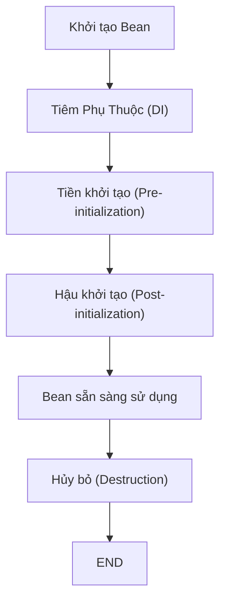
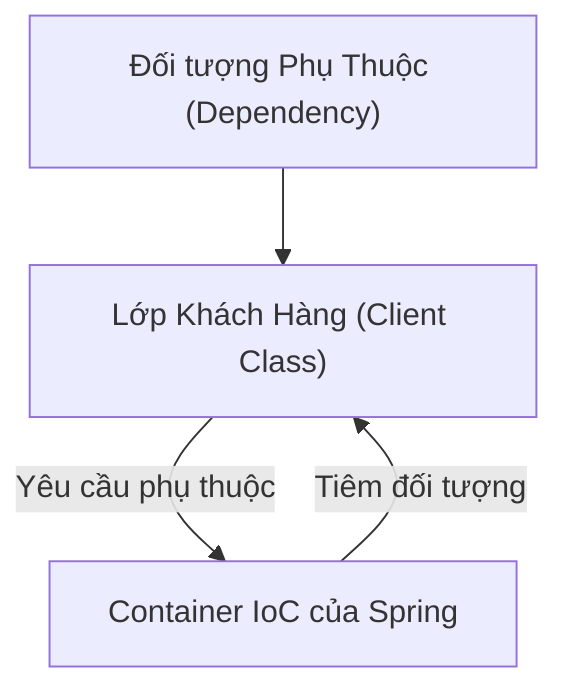

Nghiên cứu các khái niệm cơ bản của Spring Framework, bao gồm Inversion of Control (IoC), Dependency Injection (DI) và các thành phần liên quan, nhằm hiểu rõ cách hoạt động và ứng dụng của Spring trong phát triển Java.

## Mục lục

1. Giới thiệu
2. Khái niệm cơ bản về Spring Framework
    1. Inversion of Control (IoC)
    2. Dependency Injection (DI)
    3. Vòng đời của Bean và Phạm vi của Bean
3. Kiến trúc của Spring Framework
    1. Core Container
    2. Lớp Truy cập Dữ liệu và Tích hợp (Data Access/Integration)
    3. Lớp Web
    4. Các module bổ sung (Miscellaneous)
4. Spring Boot và Các Dự án Liên quan
5. Các Tính năng Nâng cao của Spring
    1. Aspect-Oriented Programming (AOP)
    2. Spring Security
    3. Spring Data và Spring Batch
    4. Spring Cloud và Hỗ trợ Cloud-Native
6. So sánh Các Thành phần Cốt lõi: BeanFactory và ApplicationContext
7. Lợi ích và Trường hợp Ứng dụng của Spring
8. Kết luận và Các Đề xuất Chính

---

## 1. Giới thiệu

Spring Framework là một framework mã nguồn mở dành cho Java, được phát triển nhằm giúp đơn giản hóa quá trình xây dựng các ứng dụng doanh nghiệp, với cấu trúc linh hoạt và có tính mô-đun cao. Framework này giúp các nhà phát triển tập trung vào logic nghiệp vụ thay vì phải lo lắng về các vấn đề cấu hình phức tạp hay quản lý các đối tượng trong ứng dụng. Với tính năng Inversion of Control (IoC) và Dependency Injection (DI), Spring Framework cho phép phân tách rõ ràng giữa các thành phần của ứng dụng, từ đó giúp tăng khả năng mở rộng, kiểm thử và bảo trì cũng như nâng cao hiệu suất phát triển phần mềm.

Từ khi ra đời, Spring đã nhanh chóng trở thành nền tảng được yêu thích trong cộng đồng Java nhờ vào khả năng tối ưu hóa quá trình phát triển, giảm thiểu mã nguồn lặp lại và tích hợp mạnh mẽ với nhiều thư viện cũng như công cụ hiện đại. Bài báo cáo này sẽ cung cấp một cái nhìn tổng quan về Spring Framework, giải thích những khái niệm cơ bản như IoC, DI, vòng đời của Bean, và trình bày kiến trúc của framework thông qua các module chính. Bên cạnh đó, chúng ta cũng sẽ xem xét vai trò của Spring Boot và các dự án mở rộng khác, cũng như so sánh một số thành phần cốt lõi nhằm giúp cộng đồng lập trình hiểu rõ hơn về nền tảng này.

---

## 2. Khái niệm cơ bản về Spring Framework

### 2.1. Inversion of Control (IoC)

Inversion of Control (lật ngược điều khiển) là một nguyên tắc trong phát triển phần mềm, trong đó việc quản lý sự phụ thuộc giữa các đối tượng được chuyển giao cho container hoặc framework thay vì tự thực hiện trong lớp chính. Trong trường hợp của Spring Framework, nguyên tắc IoC giúp tách rời quá trình tạo đối tượng ra khỏi logic nghiệp vụ, từ đó làm giảm sự phụ thuộc chặt chẽ giữa các module, giúp cho việc bảo trì và kiểm thử trở nên dễ dàng hơn.

Với IoC, các thành phần (beans) không phải tự tạo ra các phụ thuộc của mình, mà thay vào đó, các đối tượng cần thiết sẽ được container tự động tiêm vào chúng khi khởi tạo. Điều này cho phép lập trình viên dễ dàng thay thế hoặc mở rộng các thành phần mà không cần phải chỉnh sửa lại mã nguồn của lớp sử dụng chúng.

Ví dụ đơn giản, thay vì phải tạo một đối tượng mới bên trong lớp, một lớp sẽ nhận đối tượng dưới dạng tham số của constructor hoặc thông qua phương pháp setter. Quá trình này được gọi là Dependency Injection và là một trong những cách triển khai phổ biến của IoC trong Spring.

### 2.2. Dependency Injection (DI)

Dependency Injection (tiêm phụ thuộc) là một kỹ thuật để thực hiện nguyên tắc IoC. Thay vì tự tạo các đối tượng phụ thuộc, hệ thống sẽ "tiêm" các đối tượng đó vào thông qua constructor, setter hoặc field vào lúc khởi tạo lớp.

Có ba hình thức DI chính trong Spring:

1. **Constructor Injection**: Các phụ thuộc được truyền vào thông qua constructor của lớp. Phương pháp này đảm bảo các phụ thuộc bắt buộc được khởi tạo đầy đủ ngay từ lúc tạo đối tượng và thường được ưu tiên khi phụ thuộc là bắt buộc và không thay đổi.
2. **Setter Injection**: Các phụ thuộc được thiết lập thông qua các phương thức setter sau khi đối tượng đã được khởi tạo. Phương pháp này phù hợp với các phụ thuộc tùy chọn hoặc có thể thay đổi trong quá trình sống của đối tượng.
3. **Field Injection**: Sử dụng annotation `@Autowired` để tiêm trực tiếp vào các trường (field) của lớp. Tuy nhiên, cách này có thể gây khó khăn cho việc kiểm thử và bảo trì do sử dụng reflection và làm giảm tính rõ ràng của cấu trúc lớp.

Thông qua DI, Spring giúp tạo ra các ứng dụng có tính mô-đun cao, dễ dàng kiểm thử và bảo trì vì các đối tượng không phải chịu trách nhiệm khởi tạo hoặc quản lý sự phụ thuộc của mình.

### 2.3. Vòng đời của Bean và Phạm vi của Bean

Trong Spring, một bean là một đối tượng được quản lý bởi container IoC của Spring. Quá trình quản lý bao gồm việc khởi tạo, cấu hình, và hủy bỏ các đối tượng này theo một vòng đời nhất định.

**Vòng đời của Bean bao gồm:**

- **Khởi tạo**: Bean được tạo ra thông qua constructor hoặc factory method.
- **Tiêm phụ thuộc**: Các phụ thuộc được inject vào bean thông qua constructor, setter hoặc field.
- **Tiền khởi tạo (Pre-initialization)**: Sử dụng các hook như `BeanPostProcessor` cho phép thực hiện các thao tác trước khi bean thực sự sẵn sàng sử dụng.
- **Hậu khởi tạo (Post-initialization)**: Bean sau khi khởi tạo có thể được kiểm soát thông qua các custom init methods được đánh dấu bằng `@PostConstruct`.
- **Hủy bỏ (Destruction)**: Trước khi bean bị loại bỏ, các phương thức hủy bỏ (đánh dấu bởi `@PreDestroy`) được gọi để giải phóng tài nguyên.

**Phạm vi của Bean** quyết định số lượng instances của bean được tạo ra và cách nó được chia sẻ trong container:

- **Singleton**: Mỗi bean chỉ có duy nhất một instance trong container. Đây là phạm vi mặc định của Spring.
- **Prototype**: Mỗi lần yêu cầu một bean, một instance mới sẽ được tạo ra.
- **Web scopes**: Trong môi trường web, có các phạm vi như request, session, và websocket để giới hạn vòng đời của bean theo từng yêu cầu hoặc phiên làm việc.

---

## 3. Kiến trúc của Spring Framework

Spring Framework được thiết kế theo kiến trúc mô-đun, cho phép nhà phát triển chọn lựa những module cần thiết cho từng dự án mà không cần tích hợp toàn bộ framework vào đó. Kiến trúc của Spring có thể được chia thành các thành phần chính như sau:

### 3.1. Core Container

Core Container bao gồm các module cơ bản giúp khởi tạo và quản lý các bean trong ứng dụng, cụ thể:

- **Spring Core**: Cung cấp các tính năng cơ bản, bao gồm IoC và DI, cho việc quản lý và cấu hình các bean.
- **Spring Beans**: Đưa ra giao diện BeanFactory giúp truy xuất và quản lý các bean trong một container.
- **Spring Context**: Mở rộng thêm các tính năng của BeanFactory, cho phép sử dụng các dịch vụ như quốc tế hoá (i18n), sự kiện và quản lý tài nguyên.
- **Spring Expression Language (SpEL)**: Một ngôn ngữ biểu thức mạnh mẽ giúp truy xuất và thao tác với các thuộc tính của đối tượng trong runtime.

### 3.2. Lớp Truy cập Dữ liệu và Tích hợp (Data Access/Integration)

Các module trong lớp này giúp xử lý các tác vụ truy cập dữ liệu và tích hợp với các hệ quản trị cơ sở dữ liệu cũng như các công nghệ ORM:

- **Spring JDBC**: Cung cấp một lớp trừu tượng để thao tác với JDBC, giảm thiểu mã nguồn lặp lại.
- **Spring ORM**: Hỗ trợ tích hợp với các framework ORM nổi tiếng như Hibernate và JPA để đơn giản hóa việc tương tác với cơ sở dữ liệu.
- **Spring Data**: Mang lại mô hình lập trình dễ sử dụng khi làm việc với các nguồn dữ liệu khác nhau như cơ sở dữ liệu quan hệ, NoSQL và các dịch vụ dữ liệu đám mây.
- **Spring Transaction**: Hỗ trợ quản lý giao dịch một cách tuyên bố, giúp đảm bảo tính nhất quán của dữ liệu khi có nhiều thao tác truy cập cơ sở dữ liệu.

### 3.3. Lớp Web

Spring cung cấp các giải pháp để hỗ trợ phát triển ứng dụng web với các module chuyên dụng:

- **Spring MVC**: Áp dụng mô hình Model-View-Controller để xây dựng các ứng dụng web với khả năng phân tách rõ ràng giữa logic nghiệp vụ và giao diện người dùng.
- **Spring WebFlux**: Hỗ trợ lập trình phản ứng (reactive) để xây dựng các ứng dụng web đòi hỏi hiệu năng cao và khả năng mở rộng lớn.
- **Spring Web Services**: Hỗ trợ xây dựng các dịch vụ web dựa trên SOAP hoặc REST, từ việc tạo ra WSDL đến lập trình lớp dịch vụ.

### 3.4. Các Module Bổ Sung (Miscellaneous)

Ngoài các module trên, Spring còn cung cấp một số module khác nhằm đáp ứng các nhu cầu đặc thù của ứng dụng doanh nghiệp:

- **Spring Security**: Cung cấp các giải pháp xác thực và phân quyền mạnh mẽ, đảm bảo an toàn cho ứng dụng.
- **Spring Integration**: Hỗ trợ xây dựng kiến trúc dựa trên thông điệp (message-driven) và xử lý sự kiện.
- **Spring Batch**: Hỗ trợ xử lý tập hợp công việc theo lô (batch processing), hữu ích cho việc xử lý dữ liệu lớn như di chuyển dữ liệu hay ETL.
- **Spring Cloud**: Cung cấp các công cụ để xây dựng các ứng dụng cloud-native, giúp quản lý cấu hình, cân bằng tải và phát hiện dịch vụ trong hệ thống phân tán.

---

## 4. Spring Boot và Các Dự án Liên quan

Trong những năm gần đây, Spring Boot đã trở thành một phần không thể thiếu khi xây dựng các ứng dụng hiện đại. Spring Boot giúp đơn giản hóa quá trình cấu hình và triển khai ứng dụng bằng cách đưa ra các thiết lập mặc định và tích hợp sẵn các máy chủ web nhúng. Một số đặc điểm nổi bật của Spring Boot gồm:

- **Giảm thiểu cấu hình**: Sử dụng Spring Boot cho phép bạn khởi tạo dự án chỉ với vài dòng lệnh, tránh phải cấu hình XML hoặc Java Config phức tạp.
- **Máy chủ nhúng**: Các ứng dụng Spring Boot thường được đóng gói thành file "fat jar" có chứa máy chủ web như Tomcat, Jetty hoặc Undertow, giúp cho việc triển khai trở nên đơn giản hơn.
- **Tích hợp mạnh mẽ với Spring Cloud**: Khi xây dựng các ứng dụng microservices, Spring Boot có thể kết hợp với Spring Cloud để quản lý và điều phối các dịch vụ trong môi trường đám mây.

Spring Boot đã giúp các nhà phát triển giảm đáng kể thời gian thiết lập và kiểm thử, đồng thời tạo ra các ứng dụng có khả năng mở rộng tốt hơn trong môi trường thực tế.

---

## 5. Các Tính năng Nâng cao của Spring

### 5.1. Aspect-Oriented Programming (AOP)

Aspect-Oriented Programming (lập trình hướng khía cạnh – AOP) cho phép tách biệt các mối quan tâm cắt ngang (cross-cutting concerns) như logging, bảo mật, và quản lý giao dịch ra khỏi logic nghiệp vụ chính. Các thành phần AOP trong Spring bao gồm:

- **Advice**: Các hành động sẽ được thực thi khi một điều kiện nhất định xảy ra (ví dụ: trước hoặc sau khi một phương thức được gọi).
- **Pointcut**: Định nghĩa điểm cắt nơi các advice sẽ được áp dụng.
- **Aspect**: Gói gọn các advice và pointcut lại với nhau, thể hiện một mối quan tâm cắt ngang nhất định.

Sử dụng AOP, các nhà phát triển có thể giảm thiểu sự lặp lại của mã nguồn và tăng tính rõ ràng trong cấu trúc ứng dụng bằng cách tách rời các thao tác không liên quan trực tiếp đến nghiệp vụ chính.

### 5.2. Spring Security

Spring Security là một module mạnh mẽ cung cấp các giải pháp về bảo mật cho các ứng dụng doanh nghiệp. Nó hỗ trợ nhiều cơ chế xác thực và phân quyền như:

- **Xác thực cơ bản (Basic Authentication)**
- **Xác thực dựa trên biểu thức phân quyền**
- **Hỗ trợ tích hợp với các giao thức an toàn như OAuth2**

Module này giúp bảo vệ ứng dụng khỏi các lỗ hổng bảo mật phổ biến, đồng thời cung cấp giao diện tùy chỉnh để quản lý người dùng và quyền truy cập.

### 5.3. Spring Data, Spring Batch và Các Module Liên Quan

Các module này giúp đơn giản hóa các tác vụ thường gặp khi xử lý dữ liệu trong ứng dụng:

- **Spring Data**: Tạo ra một mô hình truy cập dữ liệu thống nhất, hỗ trợ nhiều công nghệ cơ sở dữ liệu khác nhau (quan hệ, NoSQL, v.v.) và cho phép thực hiện các thao tác CRUD một cách tự động từ tên phương thức.
- **Spring Batch**: Hỗ trợ xây dựng các ứng dụng xử lý theo lô với khả năng kiểm soát toàn bộ quá trình (từ đọc dữ liệu, xử lý đến ghi dữ liệu), rất hữu ích cho việc xử lý dữ liệu quy mô lớn.

### 5.4. Spring Cloud và Hỗ trợ Cloud-Native

Spring Cloud cung cấp các công cụ và thư viện để xây dựng các ứng dụng phân tán, cloud-native với các tính năng như:

- **Phát hiện dịch vụ (Service Discovery)**: Tích hợp với Eureka, Consul…
- **Cân bằng tải và Circuit Breaker**: Giúp ứng dụng tránh sự cố lan truyền khi một dịch vụ gặp lỗi.

Nhờ vậy, Spring Cloud giúp tối ưu hóa khả năng mở rộng và tính ổn định của hệ thống khi triển khai trong các môi trường đám mây như AWS, Azure, hoặc Google Cloud.

---

## 6. So sánh Các Thành phần Cốt lõi: BeanFactory và ApplicationContext

Trong Spring, hai giao diện cốt lõi để truy cập container IoC là BeanFactory và ApplicationContext. Dưới đây là bảng so sánh giữa hai giao diện này:

|**Tiêu chí**|**BeanFactory**|**ApplicationContext**|
|---|---|---|
|**Khởi tạo Bean**|Tạo bean theo yêu cầu (lazy initialization)|Khởi tạo tất cả bean singleton ngay khi container được khởi tạo|
|**Tính năng bổ sung**|Chỉ hỗ trợ DI cơ bản|Hỗ trợ thêm xử lý sự kiện, quốc tế hóa, và quản lý tài nguyên|
|**Sử dụng trong ứng dụng**|Thường dùng cho ứng dụng nhẹ hoặc môi trường resource hạn chế|Thích hợp cho ứng dụng doanh nghiệp với các tính năng mở rộng|
|**Quản lý vòng đời**|Hỗ trợ quản lý vòng đời cơ bản|Quản lý đầy đủ vòng đời của bean, bao gồm cả pre- và post-processing|

**Bảng 1: So sánh giữa BeanFactory và ApplicationContext**  
Bảng trên minh họa sự khác biệt cơ bản giữa hai giao diện quản lý bean trong Spring, cho thấy ApplicationContext cung cấp nhiều tính năng hơn so với BeanFactory, đặc biệt là đối với các ứng dụng có yêu cầu về xử lý sự kiện và quản lý tài nguyên.

---

## 7. Lợi ích và Trường hợp Ứng dụng của Spring

Spring Framework mang lại rất nhiều lợi ích cho các nhà phát triển Java và doanh nghiệp, trong đó có:

- **Đơn giản hóa quá trình phát triển**: Spring giảm bớt sự lặp lại của mã nguồn nhờ DI và IoC, giúp bạn tập trung vào logic nghiệp vụ.
- **Tăng tính mở rộng và khả năng bảo trì**: Việc tách rời các thành phần làm cho hệ thống dễ dàng mở rộng, thay đổi và kiểm thử.
- **Tích hợp mạnh mẽ**: Spring tích hợp với hầu hết các công nghệ hiện đại và các công cụ bên ngoài, từ ORM, cơ sở dữ liệu, đến bảo mật và cloud-native.
- **Hỗ trợ kiểm thử**: Nhờ vào các tính năng như DI và hỗ trợ unit testing, Spring giúp viết các bài kiểm thử hiệu quả và đáng tin cậy hơn.

### 7.1. Trường hợp Sử dụng Thực tế

Một số trường hợp sử dụng tiêu biểu của Spring bao gồm:

- **Phát triển các ứng dụng doanh nghiệp quy mô lớn**: Sử dụng Spring để quản lý các thành phần tầng trình bày, nghiệp vụ và dữ liệu một cách rõ ràng và có tổ chức.
- **Xây dựng microservices**: Sử dụng Spring Boot kết hợp với Spring Cloud để triển khai các hệ thống microservices trên đám mây với khả năng tự động mở rộng và cân bằng tải.
- **Ứng dụng web**: Áp dụng Spring MVC để phát triển các trang web tách biệt rõ ràng giữa xử lý logic và hiển thị giao diện người dùng.
- **Hệ thống xử lý theo lô và tích hợp**: Sử dụng Spring Batch và Spring Integration để xử lý các công việc tính toán, chuyển dữ liệu một cách hiệu quả và đảm bảo tính nhất quán của hệ thống.

---

## 8. Các Sơ đồ và Đại diện Trực quan

### 8.1. Biểu đồ Vòng đời của Bean trong Spring

Dưới đây là một sơ đồ thể hiện các bước trong vòng đời của một bean trong Spring:

**Sơ đồ 1: Vòng đời của Bean trong Spring**  
Sơ đồ trên mô tả các giai đoạn mà một bean trải qua trong container Spring, từ khởi tạo, tiêm phụ thuộc, qua các giai đoạn tiền và hậu khởi tạo đến khi được thu hồi tài nguyên.

### 8.2. Quy trình Dependency Injection trong Spring

Quy trình DI trong Spring có thể được minh họa như sau:

**Sơ đồ 2: Quy trình Dependency Injection trong Spring**  
Sơ đồ này cho thấy cách mà lớp khách hàng không tự tạo đối tượng phụ thuộc, mà thay vào đó, phụ thuộc được tiêm vào từ container IoC của Spring, làm giảm sự phụ thuộc chặt chẽ giữa các lớp và tăng tính mô-đun của hệ thống.

### 8.3. Bảng So sánh Các Thành phần Cốt lõi

Như đã trình bày trong mục 6, bảng so sánh dưới đây tóm tắt các điểm khác biệt giữa BeanFactory và ApplicationContext:

|Tiêu chí|BeanFactory|ApplicationContext|
|---|---|---|
|Khởi tạo Bean|Lazy initialization (tạo khi cần)|Khởi tạo ngay khi container được khởi tạo|
|Tính năng bổ sung|DI cơ bản|Hỗ trợ sự kiện, quốc tế hoá, và quản lý tài nguyên|
|Quản lý vòng đời|Quản lý cơ bản|Quản lý đầy đủ, bao gồm pre- và post-processing|
|Ứng dụng|Phù hợp với ứng dụng nhẹ|Phù hợp với ứng dụng doanh nghiệp và các dự án quy mô lớn|

**Bảng 2: So sánh BeanFactory và ApplicationContext**  
Bảng trên minh họa sự khác nhau giữa hai giao diện quản lý bean trong Spring và giải thích lý do tại sao ApplicationContext thường được lựa chọn cho các dự án quy mô lớn.

---

## 9. Kết luận và Các Đề xuất Chính

Spring Framework đã khẳng định vị thế của mình như một trong những nền tảng phát triển ứng dụng Java hàng đầu nhờ vào sự linh hoạt, khả năng mở rộng và tính mô-đun của nó. Nhờ sử dụng các nguyên tắc IoC và DI, Spring giúp giảm sự phụ thuộc giữa các thành phần, đồng thời tạo điều kiện thuận lợi cho việc kiểm thử và bảo trì ứng dụng.

**Các điểm chính rút ra từ báo cáo:**

- **Spring Framework là gì?**  
    Spring là một framework mã nguồn mở dành cho Java, giúp đơn giản hóa quá trình phát triển ứng dụng doanh nghiệp với các tính năng như IoC, DI và AOP.
    
- **Khái niệm IoC và DI:**  
    IoC giúp đảo ngược trách nhiệm tạo đối tượng, trong khi DI là cách để thực hiện nguyên tắc này, qua đó tăng tính mô-đun và khả năng kiểm thử của ứng dụng.
    
- **Vòng đời và phạm vi của Bean:**  
    Bean trong Spring được quản lý qua các giai đoạn: khởi tạo, tiêm phụ thuộc, tiền khởi tạo, hậu khởi tạo và hủy bỏ. Phạm vi của bean (singleton, prototype, …) quyết định cách sử dụng và quản lý các đối tượng này.
    
- **Kiến trúc của Spring:**  
    Spring được xây dựng theo kiến trúc mô-đun, bao gồm Core Container, lớp truy cập dữ liệu, lớp web, và các module bổ sung như Spring Security, Spring Integration, Spring Batch và Spring Cloud.
    
- **Spring Boot:**  
    Spring Boot giúp đơn giản hóa cấu hình và triển khai ứng dụng, giảm thiểu phụ thuộc vào XML hoặc cấu hình phức tạp, cho phép phát triển microservices và các ứng dụng cloud-native hiệu quả.
    
- **Các tính năng nâng cao:**  
    AOP cho phép tách rời các mối quan tâm cắt ngang, Spring Security cung cấp các giải pháp bảo mật toàn diện, và các module như Spring Data và Spring Batch hỗ trợ xử lý dữ liệu phức tạp.
    
- **So sánh BeanFactory và ApplicationContext:**  
    ApplicationContext vượt trội hơn BeanFactory nhờ vào khả năng quản lý vòng đời toàn diện và hỗ trợ tính năng mở rộng cho các ứng dụng doanh nghiệp.
    
- **Lợi ích và Trường hợp sử dụng:**  
    Spring giúp tăng tốc độ phát triển, đơn giản hoá cấu hình, nâng cao khả năng kiểm thử và bảo trì ứng dụng. Nó được sử dụng rộng rãi trong các ứng dụng doanh nghiệp, web, microservices, và các hệ thống xử lý dữ liệu lớn.
    

**Tóm tắt dưới dạng danh sách các thành tựu chính:**

- **Giảm thiểu mã nguồn lặp lại** nhờ vào DI và IoC.
- **Tăng cường kiểm thử và bảo trì** với khả năng phân tách rõ ràng giữa các thành phần.
- **Khả năng mở rộng cao** qua các module linh hoạt và tích hợp sẵn.
- **Hỗ trợ đa dạng** từ ứng dụng web cho tới microservices và cloud-native.
- **Tích hợp mạnh mẽ** với các công nghệ hiện đại như ORM, bảo mật và dịch vụ đám mây.

Nhìn chung, Spring Framework không chỉ đơn giản là một bộ công cụ phát triển mà còn là một hệ sinh thái hỗ trợ toàn diện cho các ứng dụng Java hiện đại, từ đó giúp các doanh nghiệp và lập trình viên đạt được hiệu suất công việc tối ưu và khả năng mở rộng vượt trội trong thế giới phát triển phần mềm ngày nay.

---

## Kết luận

Trong bối cảnh phát triển phần mềm hiện đại, việc lựa chọn một framework mạnh mẽ và linh hoạt như Spring để xây dựng các ứng dụng Java là một quyết định chiến lược vô cùng quan trọng. Spring Framework không chỉ cung cấp những nguyên tắc cốt lõi như Inversion of Control và Dependency Injection giúp tách biệt các thành phần của ứng dụng, mà còn tích hợp nhiều module hỗ trợ tiện ích, từ truy cập dữ liệu, bảo mật, đến xử lý giao dịch và phát triển web.

Những lợi ích mà Spring mang lại bao gồm:

- **Giảm sự phụ thuộc** giữa các module, tăng tính kiểm thử và bảo trì.
- **Khả năng mở rộng** linh hoạt với các module được chọn lọc phù hợp với yêu cầu của từng dự án.
- **Hỗ trợ phát triển nhanh chóng** thông qua Spring Boot và Spring Cloud giúp triển khai các ứng dụng microservices và cloud-native.
- **Cung cấp các giải pháp bảo mật** toàn diện với Spring Security, đảm bảo an toàn cho ứng dụng trước các mối đe dọa từ bên ngoài.
- **Tích hợp dễ dàng** với nhiều công nghệ và thư viện khác nhau, từ các công nghệ ORM như Hibernate đến các giải pháp xử lý dữ liệu theo lô như Spring Batch.

Qua bài báo cáo này, chúng ta có thể thấy rằng Spring Framework đã và đang đóng vai trò then chốt trong việc đơn giản hóa phát triển ứng dụng Java và giải quyết các vấn đề phức tạp trong kiến trúc phần mềm, từ đó tạo ra các giải pháp doanh nghiệp hiệu quả, dễ bảo trì và có khả năng mở rộng cao.

Những nội dung được trình bày đã cung cấp một cái nhìn toàn diện về Spring Framework, từ các khái niệm cơ bản như IoC, DI, đến kiến trúc chia module và các tính năng nâng cao như AOP, bảo mật, xử lý dữ liệu và hỗ trợ cloud. Những phân tích và so sánh cụ thể, kèm theo các sơ đồ và bảng trực quan, hy vọng sẽ giúp các lập trình viên, đặc biệt là những người mới bắt đầu, có cái nhìn sâu rộng và hệ thống về nền tảng này.

Cuối cùng, việc áp dụng Spring Framework cho thấy hiệu quả vượt trội trong việc giảm thiểu thời gian phát triển, tăng cường tính mở rộng và cải thiện chất lượng của ứng dụng. Do đó, Spring Framework không chỉ là lựa chọn hàng đầu trong phát triển ứng dụng Java hiện đại mà còn là một công cụ đắc lực mang lại lợi ích lâu dài cho các doanh nghiệp trong kỷ nguyên số.

---

## Tài liệu tham khảo

Tất cả các thông tin và phân tích trong bài báo cáo này được tổng hợp và trích dẫn trực tiếp từ các nguồn tài liệu cung cấp, bao gồm các tệp "Spring Framework Architecture", "IoC, Dependency Injection, Bean Lifecycle, and Scopes", "Why Java Developers Should Choose the Spring Framework", "Spring Boot Framework: Features, Benefits, and Use Cases", "Java Spring Framework: A Comprehensive Guide" và "Introduction to the Spring IoC Container and Beans" .

---

Spring Framework là một nền tảng mạnh mẽ và toàn diện, cung cấp một hệ sinh thái phong phú để phát triển các ứng dụng Java hiện đại. Việc hiểu rõ các khái niệm như IoC, DI, cấu trúc quản lý Bean, cũng như các module chính của Spring sẽ giúp các nhà phát triển tối ưu hóa quá trình phát triển phần mềm, đảm bảo tính bảo trì và mở rộng của các giải pháp doanh nghiệp. Hy vọng với bài báo cáo này, người đọc sẽ có được cái nhìn chi tiết, sâu sắc và toàn diện về Spring Framework, từ đó áp dụng hiệu quả trong công việc của mình.